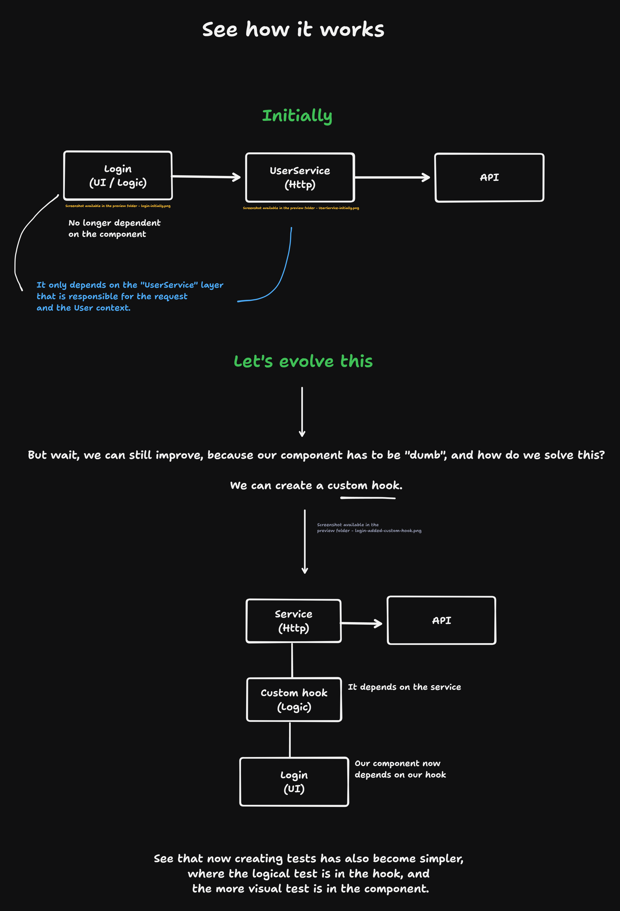

# ReactJS | Dependency Inversion (DIP) ⚛️

This project explores the **Dependency Inversion Principle (DIP)** within the context of React applications. DIP is part of the SOLID principles, which are essential for building flexible and scalable software. Through this example, you'll see how separating dependencies can lead to more modular and maintainable code.

## 📚 Summary

## 🛠️ What is SOLID?

**SOLID** is an acronym for five design principles aimed at making software designs more understandable, flexible, and maintainable:

- **S**: Single Responsibility Principle (SRP) — A class should have only one reason to change.
- **O**: Open/Closed Principle (OCP) — Software entities should be open for extension, but closed for modification.
- **L**: Liskov Substitution Principle (LSP) — Objects or instances should be replaceable with instances of their subtypes without altering the correctness of the program.
- **I**: Interface Segregation Principle (ISP) — No client should be forced to depend on methods it does not use.
- **D**: Dependency Inversion Principle (DIP) — High-level modules should not depend on low-level modules; both should depend on abstractions.

## 🎯 Objectives

- Demonstrate how to apply the Dependency Inversion Principle in React components.
- Show how to abstract dependencies to create more flexible and testable code.
- Provide practical examples of how to structure a React project following DIP best practices.

## 📂 What You'll Find

- **Code Example**: React components organized to follow the DIP.
- **Dependency Abstractions**: How to isolate and inject dependencies through contexts or hooks.
- **Best Practices**: Tips for keeping your React code clean and scalable using SOLID principles.

